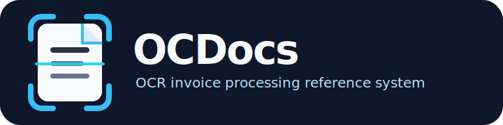

# OCR Processing System

<p align="center">
  
</p>

**OCDocs** is a public reference implementation for AI-assisted invoice processing: ingest documents, extract structured data with OCR/AI, validate fiscal fields, and prepare human review workflows.

It matters because production invoice automation is more than a model call. Real systems need orchestration, contracts, evaluation, security boundaries, and operational documentation. This repository shows those pieces together in a clean, study-friendly shape.

> This repository was published from a sanitized public export. Client-specific history, private operational notes, local environment files, and private Git history are intentionally excluded.

## What this project demonstrates

- **Document ingestion** from configurable sources such as email, drive, or storage adapters.
- **OCR and AI extraction** using a Python FastAPI/LangGraph service.
- **Background orchestration** with Trigger.dev v4 tasks.
- **Fiscal-data validation** for invoices, suppliers, taxes, totals, and review queues.
- **Evaluation workflows** with synthetic/golden fixtures and analytics dashboards.
- **Public-safe operations** with env templates, security policy, and clean-release guidance.

## Architecture at a glance

```text
Document source
   -> Trigger.dev orchestration
   -> OCR / AI extraction service
   -> Validation + normalization
   -> Supabase-backed contracts
   -> Review, analytics, and export workflows
```

The repository is intentionally organized as a **docs-first monorepo**. Each major area owns its dependencies and test commands instead of relying on a single root package manager.

## Repository map

| Path | Purpose | Main checks |
|---|---|---|
| `trigger/` | Trigger.dev v4 tasks, orchestration, client pipeline jobs, and TypeScript tests. | `npm run test`, `npx tsc --noEmit` |
| `services/sample-accounting-ai/` | FastAPI + LangGraph service for OCR, extraction, validation, and persistence flows. | `uv run pytest` |
| `analytics/` | Python dashboards, synthetic datasets, evaluation scripts, and reporting helpers. | `uv run pytest -m "not integration"` |
| `clients/sample-accounting/` | Public-safe sample client docs, contracts, and Supabase migrations. | Manual review + contract checks |
| `contracts/` | JSON schemas for service boundaries. | Schema review |
| `automations/` | Automation templates and workflow notes. | Manual review |
| `ops/` | Deployment examples for Caddy/VPS-style operations. | Manual review |
| `templates/` | Reusable PRD, proposal, SOP, and metrics templates. | Manual review |

## Quickstart

Clone the repository, then install and test the part you want to explore. The monorepo has no root package manager; each major area owns its own tooling.

### Trigger.dev tasks

```bash
cd trigger
npm install
npm run test
npx tsc --noEmit
```

### Python analytics

```bash
cd analytics
uv sync
uv run pytest -m "not integration"
```

### Python OCR / AI service

```bash
cd services/sample-accounting-ai
uv sync --extra dev
uv run pytest
```

## Configuration

Use the checked-in `*.env.example` files as templates only.

- Real `.env` files are ignored and must never be committed.
- Example values are intentionally neutral placeholders.
- Provider keys, database URLs, OAuth tokens, and customer documents belong outside Git.

Start with:

```text
env.production.example
analytics/.env.example
services/sample-accounting-ai/.env.example
env/production/*.env.example
```

## Public export and security posture

This repository was published from a clean export, not from the original private Git history.

Before publishing a derivative, adding real data, or connecting live providers, follow the checklist in [`docs/public-release.md`](docs/public-release.md):

- run secret scanning,
- keep private history out of public remotes,
- exclude local `.env` files,
- avoid reverse anonymization mappings,
- confirm docs do not expose customer-specific context.

Security issues should be reported through [`SECURITY.md`](SECURITY.md).

## Development workflow

The original project used Spec-Driven Development for substantial changes:

```text
proposal -> specs -> design -> tasks -> apply -> verify -> archive
```

The public export keeps the useful implementation and documentation while leaving private planning history behind. For new work, keep changes small, testable, and reviewable.

## Verification checklist

Run the checks that match the files you changed:

```bash
git diff --check

cd trigger && npm run test && npx tsc --noEmit
cd ../analytics && uv run pytest -m "not integration"
cd ../services/sample-accounting-ai && uv run pytest
```

For release or publication work, also run a secret scanner such as:

```bash
gitleaks dir . --redact=100
```

## License

This project is released under the [MIT License](LICENSE).
